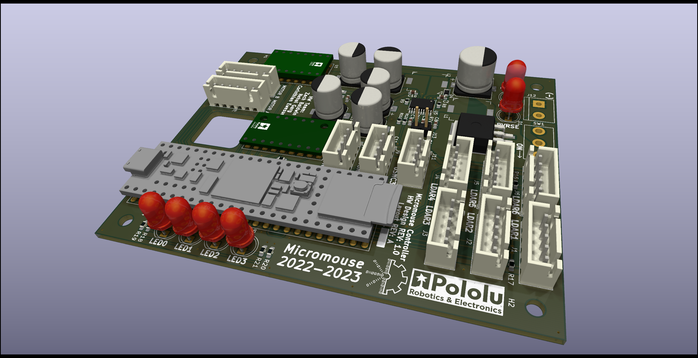

# Hardware Docs & Meeting Notes

The PCB for this year's Micromouse robot makes use of several pre-built modules to simplify the pCB design. The motor drivers, accel/gyro, and Teensy 4.1 are "socketed" using headers while a custom buck/boost converter is used to generate the 5V and 3V3 rails needed by everything.

## 10/9

### TODO

* find gyro - probably i squared c 
* create Teensy on kicad
* find / reverse engineering motor controllers (DRV8871) schematics

### Parts :

* Should have
  - 6 sensors with 2 pins for i squared c and ground (software placement)
  - A voltage regulator 
  - i squared c "I2C" - protocol that is bi directional 
  - JST connectors
  - Teensy 4.1 : powerful microcontroller 
  - motor controllers : h bridge clip with capacitors 
    + can integrate into the board or kept it separate and connect manually
    + jst connectors
  - power switch
  - reset switch
  - gyro : type of sensor 
* Nice to have
  - battery protection : not required but nice to have
  - dip switches to go into debugging mode (nice to have)
  - leds for general debugging (nice to have)
  - whiteboard for labeling (nice to have)

